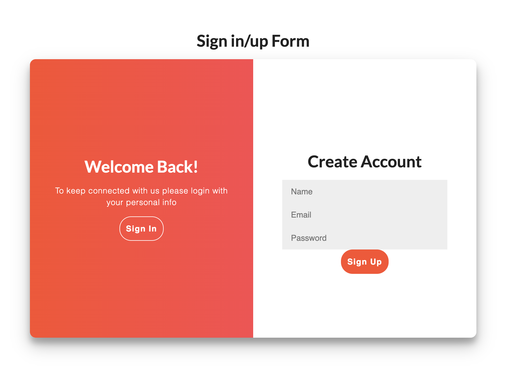
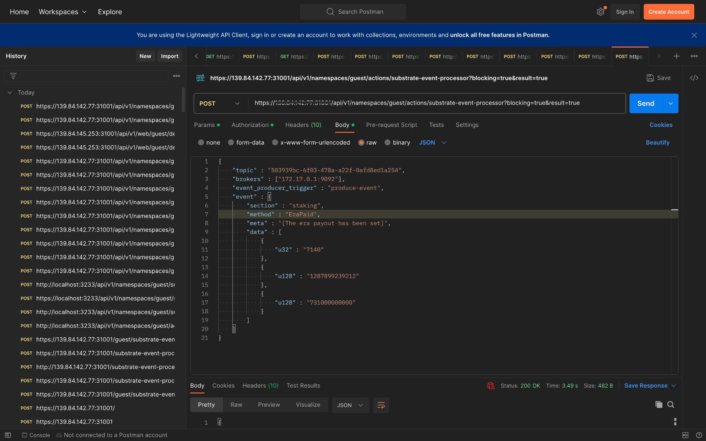

# Integration test for Polkadot Payout Notification

## Steps

1. Make sure the aurras is up and running
2. Make sure [wsk cli](https://github.com/apache/openwhisk-cli) is installed.
3. Install the [actions](../../../#installation)
4. **Workflow generation with composer:**
   Once your YAML configuration is ready, hand it over to the composer. This composer leverages the configuration to produce a WebAssembly (wasm) file. This wasm file encapsulates the workflow based on your specified criteria. 
   Generating a wasm file `e.g.: output.wasm` from the [PayoutNotification.yaml](../workflow/examples/PayoutNotification.yaml).

   ```
   cat examples/PayoutNotification.yaml | docker run -i hugobyte/workflow-composer:v0.2 generate > output.wasm
   ```

5. **Deployment to openwhisk environment:**
   After creating a wasm file, copy the wasm file from `workflow` directory to the `runtime/openwhisk` directory. Rename the `output.wasm` into `workflow.wasm`, However wasm file should undergo compilation into executable format, tailord for openwhisk depolyment. Which can be done by using the below command
   
   ```
   zip -r - Cargo.toml src workflow.wasm | docker run -e RELEASE=true -i --rm hugobyte/openwhisk-runtime-rust:v0.3 -compile main > output.zip
   ```

6. **Creating the action:** Action name -  `polkadot_payout`
   
   ```
   wsk -i action create polkadot_payout  output.zip --docker hugobyte/openwhisk-runtime-rust:v0.3 --timeout 300000 --web true --param allowed_hosts "<allowed_hosts>"
   ```

7. After Creating the action, **create a rule** for it

   ```
   wsk -i --apihost <API_HOST> rule update "payout_notify-rule" "send-payout-notify" "payout_notify" --auth <AUTH_KEY>
   ```

8. Register event source using the below command with name as param `e.g.: --name polkadot_payout`.
   
   ```
   ./register_event_source_polkadot.sh --name polkadot_payout --openwhiskApiHost <API_HOST>
   ```

9.  After registering the event, the system generates a topic. Please make sure to keep a record of this token.

10. Navigate to `aurras/example/payout-notification` directory.

11.  Add [API configuration](../examples/payout-notification/src/config/common.json) and [Firebase Push Notification Configuration](../examples/payout-notification/src/config/firebase.js).

12. Install Node Dependencies using `yarn install` or `npm install`

13. Start Payout-notification using `npx yarn start`
> For Brave browser enable `Use Google services for push messaging` using brave://settings/privacy

14.   User registration and user login actions are performed here by giving the credentials like name, email and password.
    

### OR

### By Using Curl Command 

User registration should be done by giving the parameters like name, email and password. 
    
   ```
   curl -X POST "<API_HOST>/api/v1/web/guest/default/user-registration.json?blocking=true&result=true" -H 'Content-Type: application/json' -u <TOPIC_TOKEN> -d '{"name": "john.doe", "email": "john.doe@domain.com", "password":"abc@123"}' -k
   ```
    

User can login with the credentials mentioned during the registration, this will create the JWT token
    
   ```
   curl -X POST "<API_HOST>/api/v1/web/guest/default/user-login.json?blocking=true&result=true" -H 'Content-Type: application/json' -u <TOPIC_TOKEN> -d '{"email": "john.doe@domain.com", "password": "abc@123"}' -k
   ```

    
15.  Registering the payout notification
    

16.  Now the next step is to run [aurras-event-feed-substrate-js](https://github.com/HugoByte/aurras-event-feed-substrate-js).

17.  Create a `.env` file.
    
   ```
    CHAIN_NAME=NodeTemplate
    CHAIN_ENDPOINT=wss://westend-rpc.polkadot.io
    LOGGERS=console,info;file,error,./logs/event-feed.log
    EXCLUDES=system; balances Deposit, Endowed, DustLost; staking-Chilled, ForceEra, Kicked, Slashed,  SlashReported, Stakers Elected, Validator
    TYPES_FILE=/config/types.json
    KAFKA_BROKERS=172.17.0.1:9092
    OPENWHISK_API_KEY=<AUTH_KEY>
    OPENWHISK_API_HOST=<API_HOST>
    OPENWHISK_NAMESPACE=guest
    EVENT_RECEIVER=event-receiver
    EVENT_PROCESSOR=substrate-event-processor
    TOPICS=staking=<TOPIC> 
   ```
    

18.  Install the Node Dependencies using `yarn install` or `npm install`.

19.  Start aurras-event-feed-substrate-js using `npx yarn serve`
    
*NOTE*

### Mocking the era payout, Instead waiting for 6 hours.###

In postman,
- Giving post method with https://<API_HOST>/api/v1/namespaces/guest/actions/substrate-event-processor?blocking=true&result=true
  

### Expected Output
- Payout notification : Here 1 era = 6 hours. After 1 era we will get a notification saying, "era payout completed".
  

- Verifying the push notification in chrome
  
