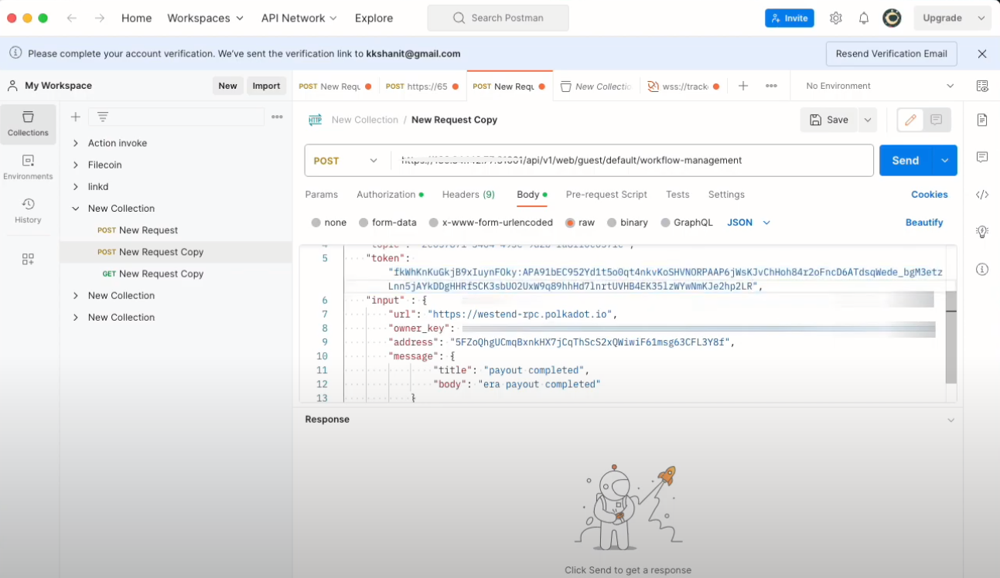

# Integration test for Polkadot Payout Notification

## Steps

1. Make sure the aurras is up and running
2. Make sure [wsk cli](https://github.com/apache/openwhisk-cli) is installed.
3. Install the [actions](../../../#installation)
4. **Workflow generation with composer:**
   Once your YAML configuration is ready, hand it over to the composer. This composer leverages the configuration to produce a WebAssembly (wasm) file. This wasm file encapsulates the workflow based on your specified criteria. 
   Generating a wasm file `e.g.: output.wasm` from the [PayoutNotification.yaml](../workflow/examples/PayoutNotification.yaml).

   ```
   cat examples/PayoutNotification.yaml | docker run -i hugobyte/workflow-composer:v0.2 generate > output.wasm
   ```

5. **Deployment to openwhisk environment:**
   After creating a wasm file, copy the wasm file from `workflow` directory to the `runtime/openwhisk` directory. However wasm file should undergo compilation into executable format, tailord for openwhisk depolyment. Which can be done by using the below command
   
   ```
   zip -r - Cargo.toml src output.wasm | docker run -e RELEASE=true -i --rm hugobyte/openwhisk-runtime-rust:v0.3 -compile main > output.zip
   ```

6. **Creating the action:** Action name -  `polkadot_payout`
   
   ```
   wsk -i action create polkadot_payout  output.zip --docker hugobyte/openwhisk-runtime-rust:v0.3 --timeout 300000 --web true --param allowed_hosts "<allowed_hosts>"
   ```

7. Register event source using the below command with name as param `e.g.: --name polkadot_payout`.
   
   ```
   ./register_event_source_polkadot.sh --name polkadot_payout --openwhiskApiHost <API_HOST>
   ```

8. After registering the event, the system generates a topic. Please make sure to keep a record of this token.

9. User registration should be done by giving the parameters like name, email and password. 
    
    ```
    curl -X POST "<API_HOST>/api/v1/web/guest/default/user-registration.json?blocking=true&result=true" -H 'Content-Type: application/json' -u <TOPIC_TOKEN> -d '{"name": "john.doe", "email": "john.doe@domain.com", "password":"abc@123"}' -k
    ```

10. User can login with the credentials mentioned during the registration, this will create the JWT token
    
    ```
    curl -X POST "<API_HOST>/api/v1/web/guest/default/user-login.json?blocking=true&result=true" -H 'Content-Type: application/json' -u <TOPIC_TOKEN> -d '{"email": "john.doe@domain.com", "password": "abc@123"}' -k
    ```

    OR

    Perform the action invoke `user-login` by giving the below command, this will create a user token
    
    ```
    wsk -i action invoke user-login --param email <john.doe@domain.com> --param password <abc@123> -b -r
    ```

11.  Navigate to examples/susbtrate-push-notification in Aurras
12.  Add [API configuration](../examples/substrate-push-notification/#api-configuration) and [Firebase Push Notification Configuration](../examples/substrate-push-notification/#push-notification-configuration)
13.  Install Node Dependencies using `yarn install` or `npm install`.
14.  Start susbtrate-push-notification using `npx yarn start`
> For Brave brower enable `Use Google services for push messaging` using brave://settings/privacy
15.  Select the account for which polkadot notification to be received
16.  Click Register Balance Notification button
17.  Select the event source, here in this case `polkadot_payout`. Copy the Push notification token(user device token).
18.  Open postman and try to execute it there by pasting the copied user-device-token, adding owner key, adding topic and adding  auth-token.
    
    
19. Now the next step is to run [aurras-event-feed-substrate](https://github.com/HugoByte/aurras-event-feed-substrate-js).
20. Here, change the env variables according to your usage. 
21. Install the Node Dependencies using `yarn install` or `npm install`.
22. Start aurras-event-feed-substrate-js using `npx yarn serve`
    
### Expected Output
- Payout notification : Here 1 era = 6 hours. After 1 era we will get a notification saying, "era payout completed".
  

- Verifying the push notification in chrome
  
