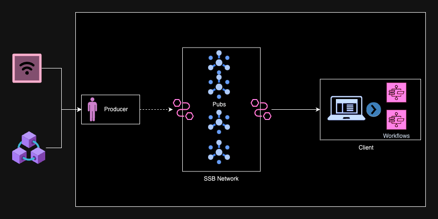

# Aurras Lite Runtime 
A runtime leveraging Secure Scuttlebutt for event streaming, designed to facilitate the seamless execution of workflows on the user side in response to specific events.
This runtime harnesses the capabilities of Secure Scuttlebutt, a decentralized messaging protocol, to efficiently stream events securely across a network. As events are emitted, the runtime captures and processes them, initiating corresponding workflows tailored to the user's preferences and requirements.

# Pre-requisites
- [SSB-server](https://github.com/ssbc/ssb-server)
- [Rust](https://www.rust-lang.org/tools/install)

## Setup
1. Install the ssb-server and start it.

        ssb-server start
2. Run the client producer or consumer or client

        corgo run --bin consumer

### Integration test setup
1. Setup a network, got the script folder 

        ./ssb-up.sh start

2. Create an invite 

        ./ssb-up.sh create-invite

3. Copy the invite and run

        ./ssb-up.sh accept-invite <paste copied invite here>
    
4. Export the secret for connecting the client

        ./ssb-up.sh copy-secret
    *Note:* This will export the secret to secret folder in the current directory.

5. Move to lite directort and create a .env file and export the secret path port for consumer.

        SECRET=../aurras/runtime/lite/scripts/secret/consumer_secret
        PORT=8015
    
6. Run the consumer client

        congo run --bin consumer

7. Run a local polakdot chain for test purpose

        docker run -p 9944:9944 parity/polkadot:v1.0.0  --dev --rpc-external

8. Run the basic example for producer with required environment variables

        PUB_ADDRESS="@pjrBmtifFU9P9NhoHRiPbn3O3xGUXtsLWJXhxLEpkug=.ed25519"
        PRODUCER_SECRET=./runtime/lite/scripts/secret/consumer_secret
        PRODUCER_PORT=8014
    *Note:* Get the pub address using script `./ssb-up.sh pub-whoami`

9. Make transfer event on the chain manually.