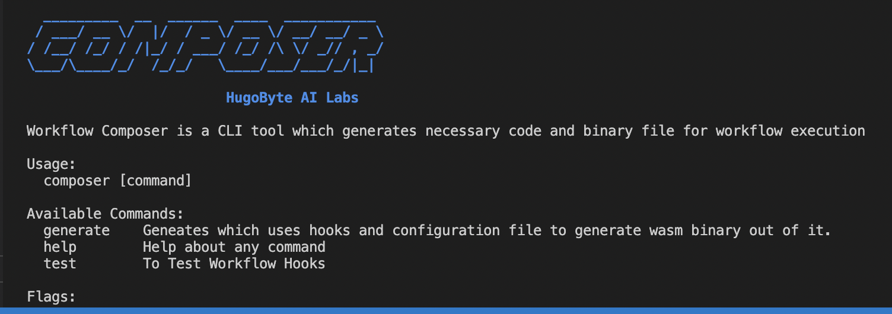
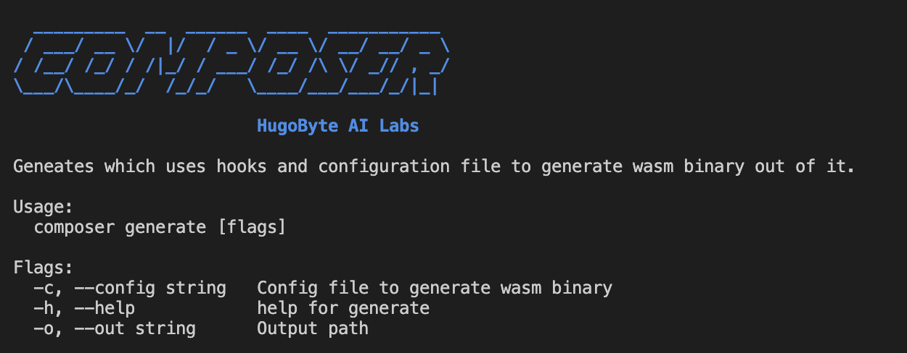
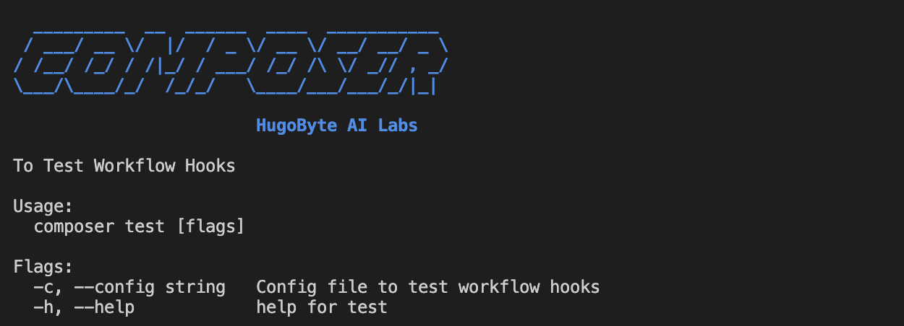

# Composer

## Description 

Composer is a cli tool which has two sub commands generate and test , generate will use the config and create wasm binary and test command will run the unit test for the provider hooks .

## Commands




### Generate

```
composer generate -c config_file -o outpath_path
``` 

 


### Test
``` 
composer test 
```
### composer test will test all the hooks & run unit test cases & return the result. 





## References
[cobra](https://github.com/spf13/cobra)


### License
[label](https://www.apache.org/licenses/LICENSE-2.0)
Licensed under [Apache-2.0](https://www.apache.org/licenses/LICENSE-2.0)


