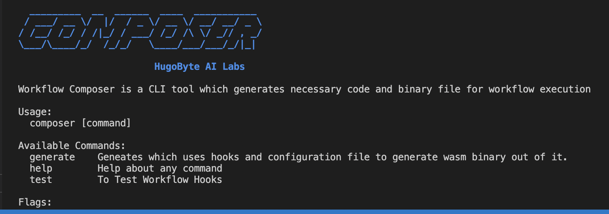
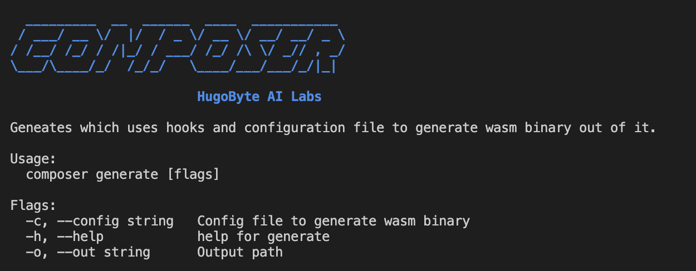
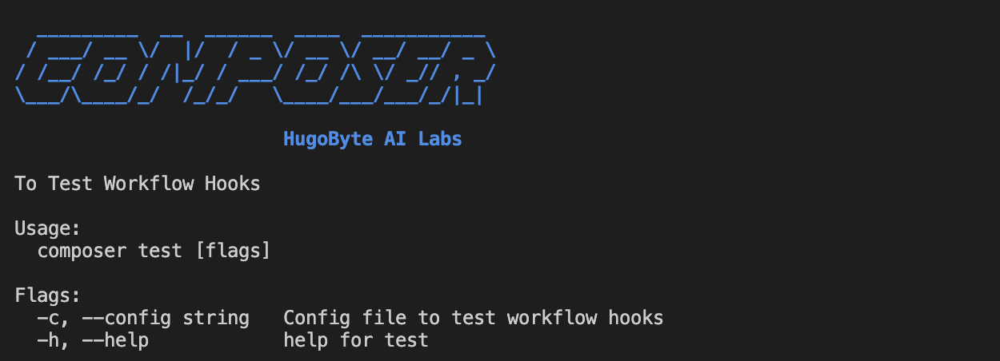

# Composer

## Description

Composer is a cli tool which used to generate `workflow wasm` and test the `provider hooks` .

## Prerequisite

- [RUST](https://www.rust-lang.org/tools/install)
- [GO](https://go.dev/doc/install)
- Tackle-Box
  `python3 -m pip install tackle-box==0.3.0-beta.5`
- Install `psutil` and `pydantic` library

  `python3 -m pip install psutil pydantic`

## Usage

The CLI consists of two commands:

- `Generate` - Used to generate WASM Binary from YAML
- `Test` - Used to test the provider Hooks



## Commands

### Generate

```
composer generate -c config_file -o outpath_path
```



### Test

```
composer test
```

### composer test will test all the hooks & run unit test cases & return the result.



### Example:

```
composer test -c ../examples/CarMarketPlace.yaml
```

```
  _________  __  ______  ____  ___________
 / ___/ __ \/  |/  / _ \/ __ \/ __/ __/ _ \
/ /__/ /_/ / /|_/ / ___/ /_/ /\ \/ _// , _/
\___/\____/_/  /_/_/   \____/___/___/_/|_|

                        HugoByte AI Labs

Running Test ...
..........
----------------------------------------------------------------------
Ran 10 tests in 2.064s

OK
Test Completed

```
## Docker

### Building the docker image
```bash
cd ..
docker build -t hugobyte/workflow-composer .
```

### Running using the docker image
```bash
cat ../examples/PolkadotPayout.yaml | docker run -i --rm hugobyte/workflow-composer generate > output.wasm
```

### Testing the hooks for provided yaml file
```bash
cat ./examples/CarMarketPlace.yaml | docker run -i --rm hugobyte/workflow-composer test
```

## References

[cobra](https://github.com/spf13/cobra)

### License

[label](https://www.apache.org/licenses/LICENSE-2.0)
Licensed under [Apache-2.0](https://www.apache.org/licenses/LICENSE-2.0)
